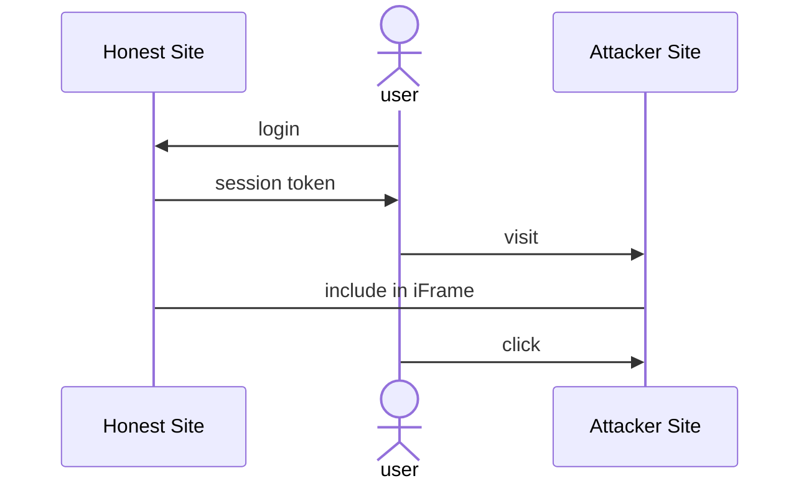

# Clickjacking example app

This repository contains a sample web application with Clickjacking vulnerabilities and its attacker website.

This example was inspired by **[clickjacking-sample-app](https://github.com/auth0-blog/clickjacking-sample-app)**.

---

### 🧾 Requirements

- [Node.js](https://nodejs.org/)

### 🔧 Setup

Install the package locally with **npm** or an equivalent package manager

```shell
npm install
```

### ▶️ Running the Application

The application is made up of 2 web servers using express: the *server* and the *attacker*.
The former represents the site subject to this kind of attack, the latter is the web site the attacker creates which exploits the vulnerability.

First of all, launch the *server* by running

```shell
npm start
```

You can visit the site by inserting the [http://localhost:3000](http://localhost:3000) address in your web browser.

Then it's the turn of the attacker website.
It can be launched using the command

```shell
npm run start-attacker
```

The attacker's site will be located at [http://localhost:4000](http://localhost:4000).

## 👾 Attack

### How to start the attack

Once both web servers are up and running, go to the *[honest site](http://localhost:3000)* and login. You can use any username and password.
Keep in mind that the only thing that matters is the username. Logging multiple times with the same username will use the same session.
You see you have two options presented to you. Choosing either one will lock your decision. Logging in again with the same username won't allow you to change your choice until the server is restarted.

To showcase the attack, make sure to login in the *[honest site](http://localhost:3000)* and then close the tab without making any choice. Then, visit the *[attacker site]([http://localhost:4000](http://localhost:4000).)* and click the only button you are presented with. Apparently nothing happens.
However, if everything went as expected, once you go back to the *[honest site](http://localhost:3000)* you will notice the choice is already been made.

### How does the attack work

When logging in the *[honest site](http://localhost:3000)* a session is created and a token is stored client side (in the browser) to avoid the user the hassle to log in every time. You can verify this by logging in, then closing the window and visiting the *[honest site](http://localhost:3000)* again. You will find yourself already logged in.

This means that, if the *[attacker site]([http://localhost:4000](http://localhost:4000).)* manages to include the *[honest site](http://localhost:3000)* in an iframe, if the user has already logged in, the authenticated section will be included.
The attacked can easily make the iframe invisible and trick the user in clicking button without them noticing.



### How to prevent this kind of attack

Server side, the simplest way to prevent this kind of attack is to include the 

`X-Frame-Options: DENY`

header in the response. Any modern browser will refuse to include any web site with this header in an iframe.

Client side, your best bet would be to avoid sketchy websites and, when possible, remembering to log out from all web sites when possible or using something like incognito mode to avoid the browser saving session cookies.

## 📖 References

- [clickjacking-sample-app](https://github.com/auth0-blog/clickjacking-sample-app)
- [Clickjacking Attacks and How to Prevent Them](https://auth0.com/blog/preventing-clickjacking-attacks/)

